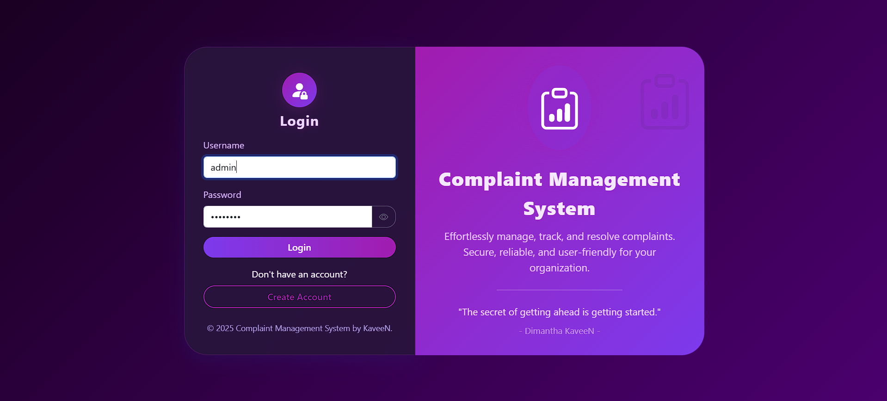
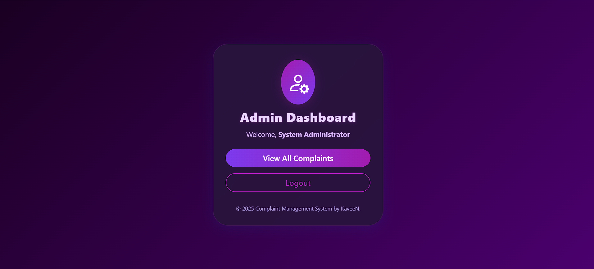
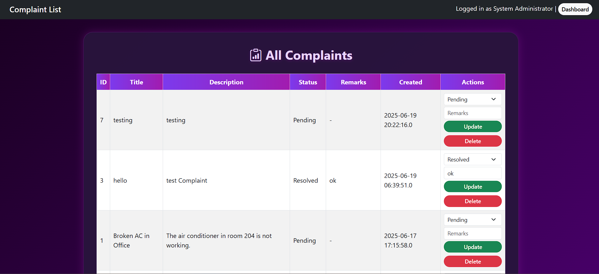

# Complaint Management System (CMS) by KaveeN

## 📌 Project Overview

A full-stack web application designed to manage, track, and resolve complaints submitted by employees within an organization. Built using **JSP + Servlets + MySQL**, the system supports both **Employee** and **Admin** roles with secure login, role-based dashboards, and real-time complaint tracking.

The application features a modern **Midnight Purple UI**, responsive design, form validation, and secure session handling — all powered by a robust MVC architecture.

---

## ✅ Features

- 🔐 **Authentication with Session**
  - Role-based dashboards for **Employees** and **Admins**
  - Login & Logout with SweetAlert2 notifications

- 🧑‍💼 **Signup for Employees**
  - Create new accounts with validation
  - Data stored securely in MySQL

- 📝 **Complaint Management**
  - Employees: Add, view, and delete own unresolved complaints
  - Admins: View all complaints, update status and remarks, delete any complaint

- 🎨 **Midnight Purple UI**
  - Glassmorphism style with Bootstrap 5.3 + Icons
  - Responsive layouts for desktop and mobile

- ⚠️ **Form Validations**
  - JS-based field validation and SweetAlert2 confirmations

---

## 📸 Screenshots

### 🟣 Login Page


### 🔵 Admin Dashboard


### 🟢 Complaint List


---

## 📸 Video

### 🟣 YouTube Link

Watch the full system demo on YouTube:  
🎥 [CMS Project 2025 - IJSE 72 Dimantha Kaveen Galle](https://www.youtube.com/watch?v=ts2SuViEZxA)

---


## 💻 Technologies Used

- **Java 21**
- **Jakarta EE (Servlet 6.0)**
- **JSP + HTML + CSS + JS**
- **Bootstrap 5.3 + SweetAlert2**
- **MySQL 8+**
- **Apache Commons DBCP 2**
- **Apache Tomcat 11**
- **Maven (WAR packaging)**

---

## 📦 Project Structure

```

Complaint-Management-System/
├── db/
│   └── schema.sql
├── src/
│   └── main/
│       ├── java/
│       │   └── lk/ijse/edu/complaintmanagementsystem/
│       │       ├── controller/
│       │       │   ├── LoginServlet.java
│       │       │   ├── LogoutServlet.java
│       │       │   ├── SignupServlet.java
│       │       │   └── ComplaintServlet.java
│       │       ├── model/
│       │       │   ├── Complaint.java
│       │       │   ├── User.java
│       │       │   └── dao/
│       │       │       ├── ComplaintDAO.java
│       │       │       ├── UserDAO.java
│       │       │       └── DBCPDataSource.java
│       │       └── util/
│       │           ├── DBUtil.java
│       │           └── CrudUtil.java
│       └── webapp/
│           ├── view/
│           │   ├── login.jsp
│           │   ├── signup.jsp
│           │   ├── adminDashboard.jsp
│           │   ├── employeeDashboard.jsp
│           │   ├── complaintForm.jsp
│           │   └── complaintList.jsp
│           ├── css/
│           │   └── style.css
│           ├── js/
│           │   └── script.js
│           ├── index.jsp
│           └── WEB-INF/
│               └── web.xml
├── pom.xml
└── README.md

````

---

## 🧪 How to Run (Local Setup)

1. **Clone the repository**
```sh
git clone https://github.com/KaveenDK/Complaint-Management-System.git
cd Complaint-Management-System
````

2. **Import into IntelliJ IDEA or Eclipse**

3. **Create Database**

    * Import `/db/schema.sql` into your local MySQL
    * Update DB credentials in `DBCPDataSource.java`

4. **Run on Apache Tomcat 11**

    * Build WAR using Maven or deploy from IDE
    * Access: `http://localhost:8080/Complaint-Management-System/`

---

## 🔄 Future Enhancements

* 📬 Email notifications on complaint status updates
* 📊 Analytics dashboard for Admin
* 🧾 Complaint categories and filtering
* 🌐 Internationalization (i18n)

---

## 🙌 Author

> `Dimantha Kaveen`
> **Batch**: IJSE GDSE-72
> **Branch**: Galle
> 💼 Full-stack Java Developer in training

---

## ☕ Support Me

If you like this project and want to see more:

[Buy me a coffee](https://www.buymeacoffee.com/vpdkkaveenp)

---

